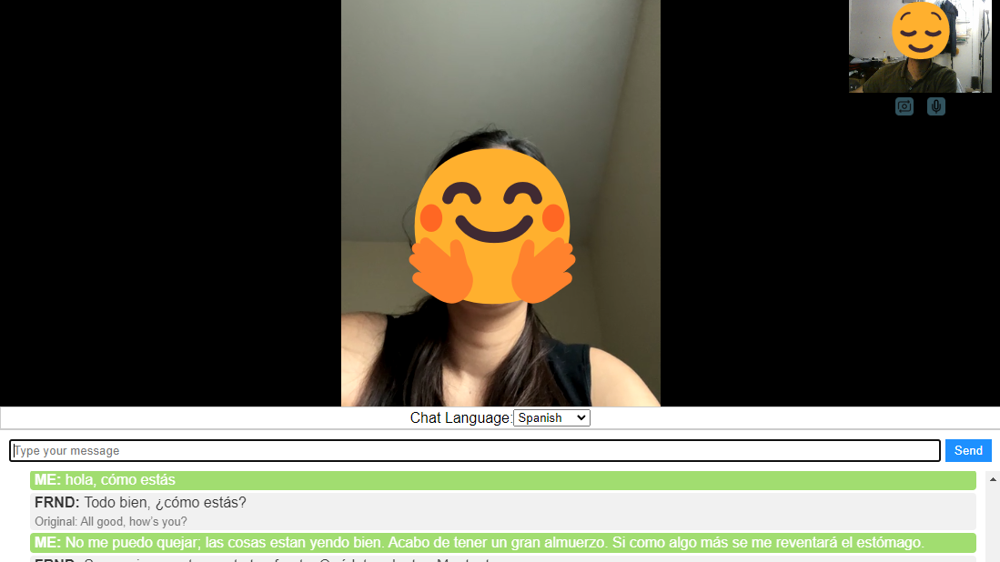

# Translate Call

Translate Call is a web application that facilitates seamless communication across language barriers. It enables real-time messaging and video chat with integrated message translation using Azure API, offering a robust solution for multilingual conversations.



## Key Features

- **Real-Time Messaging**: Send and receive messages instantly, with live translation capabilities.
- **Video Chat**: Engage in video calls to communicate face-to-face across different languages.
- **Azure API Integration**: Utilizes Azure's translation services for accurate and efficient message translation.
- **ScaleDrone Toolkit**: Implements ScaleDrone for reliable and scalable video calling functionality.

## Why Translate Call?

Translate Call was developed to foster communication between individuals who speak different languages, promoting inclusivity and understanding in diverse communities. The app aims to eliminate the language barrier, allowing people of different ethnicities and mother tongues to converse effortlessly.

## Technologies Used

- **Node.js**: For the backend runtime environment.
- **Express.js**: As the web application framework.
- **EJS (Embedded JavaScript)**: For templating and generating dynamic HTML.
- **Azure API**: For real-time message translation.
- **ScaleDrone**: For video calling functionality.
- **CSS**: For styling the application.
- **JavaScript**: For client-side scripting.

## Getting Started

Follow these steps to set up Translate Call on your local machine.

### Prerequisites

- Node.js (v12.x or later)
- npm (v6.x or later)

### Installation

1. Clone the repository:
    ```bash
    git clone https://github.com/KoustubhSahu/translate-call.git
    ```
2. Navigate to the project directory:
    ```bash
    cd translate-call
    ```
3. Install the dependencies:
    ```bash
    npm install
    ```
4. Start the application:
    ```bash
    npm start
    ```
5. Open your browser and navigate to `http://localhost:3000`.

## Usage

- **Real-Time Messaging**: Enter your message in the input field, and it will be translated to the desired language in real-time.
- **Video Chat**: Start a video call and communicate with others face-to-face, with live message translation.

## Contributing

Contributions are welcome! If you have suggestions or improvements, please create an issue or submit a pull request.

1. Fork the repository.
2. Create your feature branch:
    ```bash
    git checkout -b feature/AmazingFeature
    ```
3. Commit your changes:
    ```bash
    git commit -m 'Add some AmazingFeature'
    ```
4. Push to the branch:
    ```bash
    git push origin feature/AmazingFeature
    ```
5. Open a pull request.

## License

This project is licensed under the MIT License. See the [LICENSE](LICENSE) file for details.

## Contact

Feel free to reach out with any questions or feedback:
- GitHub: [KoustubhSahu](https://github.com/KoustubhSahu)

---

Thank you for using Translate Call! We hope it helps you connect with people around the world without language barriers.
